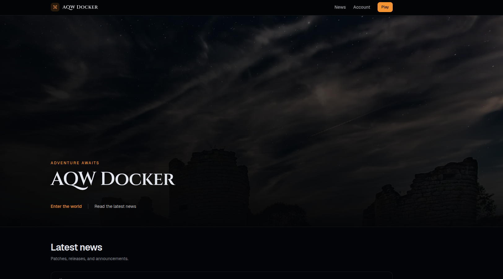
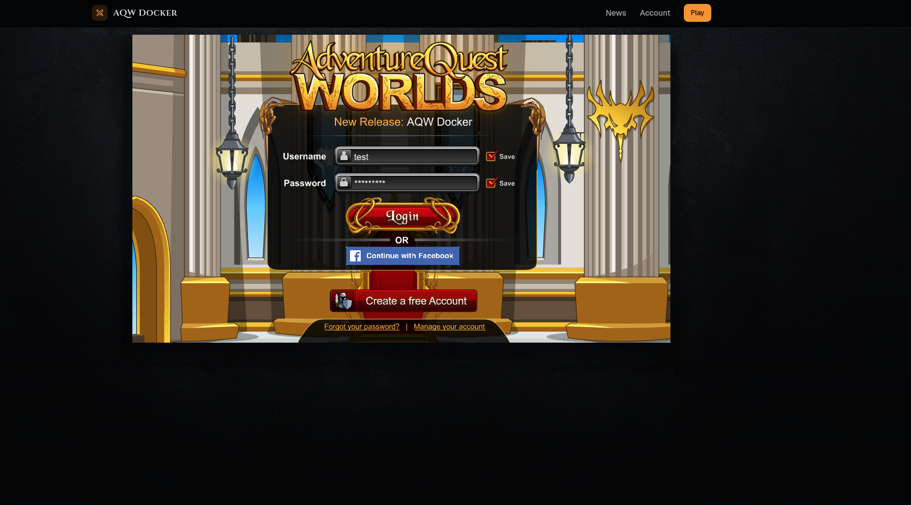
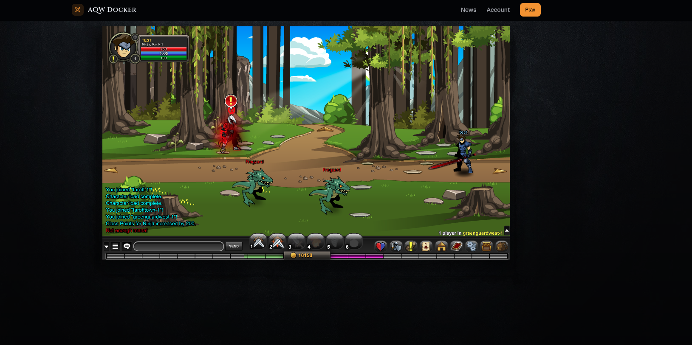
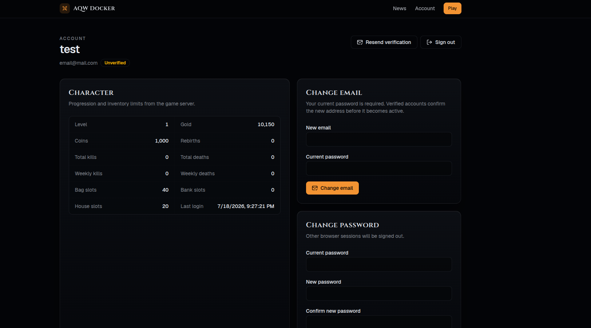

# AQW Docker

Run your own AQW private server on your computer with Docker. The website,
game server, and database are started automatically.

## Screenshots

### Homepage



### Login



### Gameplay



### Account



## What you need

- [Docker Desktop](https://docs.docker.com/get-started/get-docker/)
- This project downloaded and extracted

## Start the server

Open a terminal inside the project folder.

On Windows (PowerShell):

```powershell
Copy-Item .env.example .env
docker compose up --build -d
```

On macOS or Linux:

```bash
cp .env.example .env
docker compose up --build -d
```

The first start may take a few minutes. When it finishes, open:

**http://127.0.0.1:8081**

Click **Play** to create a character and enter the game.

## Customize your server

Open the `.env` file with any text editor. It is best to make changes before
starting the server for the first time.

These are the most useful settings:

```env
# Names shown on the website and server list
SITE_NAME=My AQW Server
SERVER_NAME=My Server

# Message shown to players
GAME_SERVER_MOTD=Welcome to my server!

# Maximum number of online players
GAME_SERVER_MAX_PLAYERS=100

# Starting storage limits
GAME_MAX_BAG_SLOTS=100
GAME_MAX_BANK_SLOTS=200
GAME_MAX_HOUSE_SLOTS=50
```

Change only the text after `=` and keep each setting on its own line. After
saving the file, apply your changes with:

```bash
docker compose up --build -d
```

## Stop or start it again

Your characters and progress are saved when the server stops.

```bash
# Stop
docker compose down

# Start again
docker compose up -d
```

## Problems?

Make sure Docker Desktop is running, then check the server status:

```bash
docker compose ps
```

To see error messages:

```bash
docker compose logs
```

This setup is for playing locally on the same computer. Hosting it on the
internet requires extra security and network configuration.
